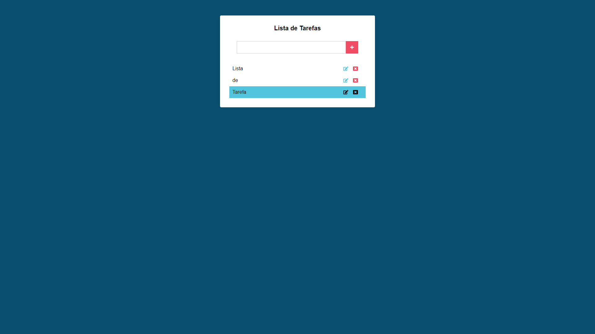

# React

## Table of contents

- [Overview](#overview)
  - [The challenge](#the-challenge)
- [My process](#my-process)
  - [Built with](#built-with)
  - [What I learned](#what-i-learned)
- [Author](#author)

## Overview

- Aplicação React de uma Lista de Tarefas

### The challenge

Criar aplicação de uma Lista de Tarefas e salvar os dados no Local Storage

## My process

### Built with

- React

### What I learned

- O Básico do React utilizando classes (Só tinha utilizado hooks até então)

## Author

- Github - [Marcos Vinicius Silva](https://github.com/SenhorOver)
