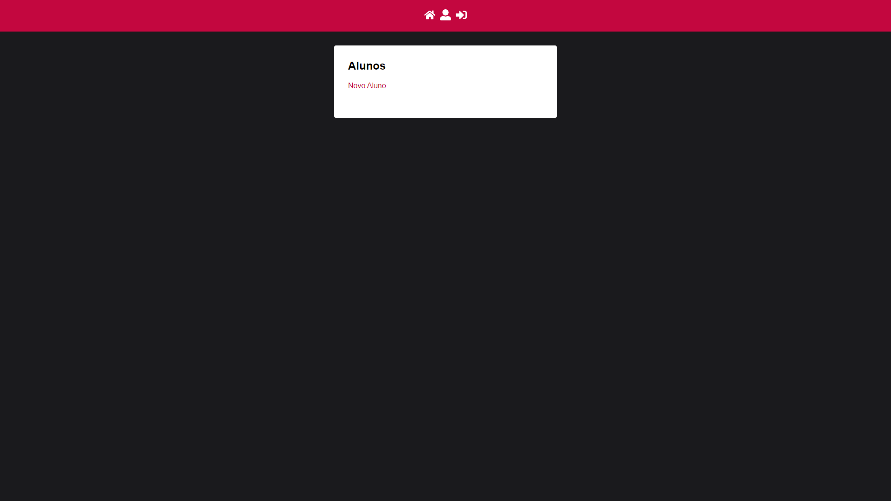

# React Redux

## Table of contents

- [Overview](#overview)
  - [The challenge](#the-challenge)
- [My process](#my-process)
  - [Built with](#built-with)
  - [What I learned](#what-i-learned)
- [Author](#author)

## Overview

- Aplicação React que consome uma [API REST](https://github.com/SenhorOver/api-rest-sequelize-mariadb), além de possuir sistema de Login e manter a formatação do código com eslint e prettier - (Projeto ainda em andamento)

### The challenge

Criar aplicação funcional para consumir API REST

## My process

### Built with

- React
- Redux
- Redux-Saga
- Redux-Persist
- Styled Components
- Validator

### What I learned

- Diversos conceitos do React
- Como implementar e utilizar Redux
- Novas Funções do Styled Components

## Author

- Github - [Marcos Vinicius Silva](https://github.com/SenhorOver)
